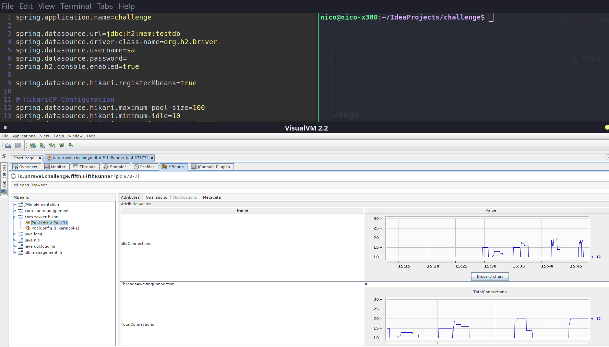

# Exercise 5 Solution

- issues with database
  connections under high concurrency, particularly during peak loads.

- implement a
  custom monitoring solution that logs when connections are waiting too long or are
  being underutilized

- optimize pool size based on usage patterns,
  and avoid simply increasing the pool size to resolve connection bottlenecks.

1. Explain briefly current implementation of BenchmarkController
2. Mention the ab commands used and the screenshot taken of visualvm. Note that Total connections peaked at 20, indicating that the suggested pool size of Hikari docs is an exact estimate of the max tolearable pool size for my laptop. In fact, `(8 cores * 2) + 1 spindle = 17`, which is very close to 20

| Symptom                        | Possible Cause                                     |
| ------------------------------ | -------------------------------------------------- |
| Pool always at max connections | Insufficient pool size, connection leaks, slow DB  |
| Threads waiting for connection | Pool exhaustion or DB slowness                     |
| Frequent GC or memory pressure | Connection/resultset leaks, or object accumulation |
| High CPU usage in JDBC methods | Inefficient SQL queries or overfrequent calls      |
| Stuck threads in DB methods    | Long-running or blocked DB operations              |

