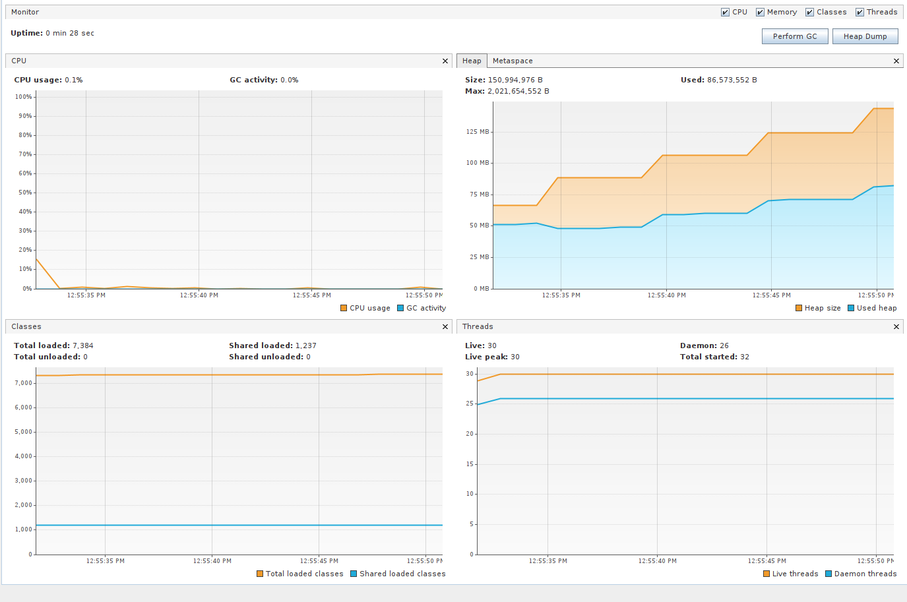
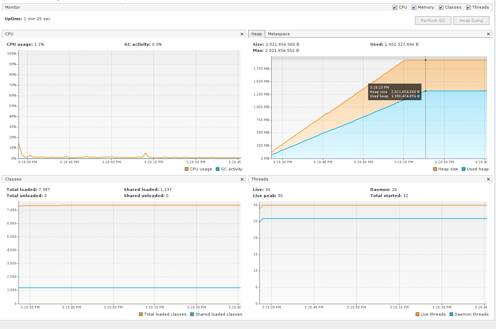

# Exercise 2 Solution

The memory leak here is caused by `MemoryManager` class which is storing a strong reference to a chunk of 10MB of 
memory in a static field. Therefore, upon several invocations, the heap size will steadily increase and, sooner or 
later, we'll probably end up with a `OutOfMemoryError` exception. This can easily be seen in the following VisualVM 
screenshot due to the upward trend of the used heap space.



A possible solution to the memory leak is to use a `DelayQueue` of `SessionExpiry`. In this way, we can leverage the 
`Delayed` interface for comparing the `expiryTime` of `SessionExpiry` objects: whenever a session is expired 
then the head of the queue can be "taken" and, therefore, the associated data can be freed. As we can see from the 
following screenshot, after an initial ramp up period, heap space stabilizes after 1 minute since all the 
`SessionExpiry` objects are created with:

```java
new SessionExpiry(sessionId, TimeUnit.MINUTES.toMillis(1))
```



A nice benefit of this approach is that the session cleanup happens during normal usage of the Manager, meaning that 
is completely transparent to the class's client(s). However, if no add or remove session data operations occur, the 
cleanup is not triggered. Nonetheless, we can tackle this drawback by using a `ScheduledThreadPoolExecutor` which, 
upon session expiration, would have used dedicated threads for the cleanup.

Regarding the last point of the exercise, that is "reducing memory pressure", we could opt for storing the 
session data in a SQL database, ideally via `spring-boot-session-jdbc`.